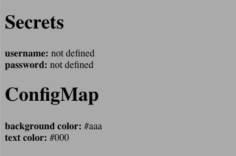
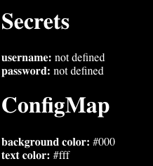

# 7.2 Volumes

We already explained a use case of how kubeless uses volumes.  Let's go through a few examples of volumes to make things more concrete.  We'll first use a generic NFS mount and then move to ConfigMaps and Secrets.  

## 7.2.1 NFS Volume Example

Our NFS server is a simple ubuntu server running NFS.  We followed [simple instructions](https://www.smarthomebeginner.com/install-configure-nfs-server-ubuntu/) to create a volume called `/nfs/vol1` on the server with IP address `172.28.225.138`.  

An important note that for NFS to work the worker nodes that are using NFS will need to have an nfs client installed at the host level.  For our ubuntu servers we run: 

```
sudo apt-get install nfs-client
```

In this directory on the NFS server we can prepopulate an `index.html` that can be mounted to our pods that they can serve.   

We create an nginx deployment that looks as follows: 

```
apiVersion: extensions/v1beta1
kind: Deployment
metadata:
  labels:
    run: ngxnfs
  name: ngxnfs
  namespace: default
spec:
  replicas: 1
  selector:
    matchLabels:
      run: ngxnfs
  template:
    metadata:
      labels:
        run: ngxnfs
    spec:
      containers:
      - image: nginx
        name: ngxnfs
        volumeMounts: 
          - name: nfsvol
            mountPath: /usr/share/nginx/html/
      volumes:
      - name: nfsvol
        nfs:
          server: 172.28.225.138
          path: /nfs/vol1
---
apiVersion: v1
kind: Service
metadata:
  labels:
    run: ngxnfs
  name: ngxnfs
  namespace: default
spec:
  ports:
  - port: 80
    protocol: TCP
    targetPort: 80
  selector:
    run: ngxnfs
  sessionAffinity: None
  type: LoadBalancer
```

When we navigate to the service we see that it has the contents of our NFS server.  We can scale the nodes up and each time we can hit the same IP: 

```
kubectl scale --replicas=5 deployment ngxnfs
```

## 7.2.2 Projected Volume Example

There is often data we want applications running in our pods to get.  A `projected` volume is a way we can combine data from different kubernetes contructs into a single volume.  These kubernetes resources include: 

* `secret`
* `downwardAPI`
* `configMap`
* `serviceAccountTokens` 

Let's introduce a few of these for our sample we will make.  

### 7.2.2.1 Kubernetes Secrets

The twelve factor app was introduced to the world around 2011 by developers at PaaS providers Heroku.  In this "manifesto" 12 important attributes of SaaS based applications are defined.  This manifesto is somewhat of an ancestor to today's microservices.  

One of the important take-aways from the 12 factor app manifesto is that applications should never store config data or important data like passwords, keys, or other sensative information.  The arguments are that this is insecure and not best practices.  The solution is to store this information in environment varables.  

In a kubernetes environments, how can we get things like database passwords to an environment variable?  We could pass the environment variable as part of the pod.yaml file but the pod.yaml file is usually checked in with the code.  The answer is that we use [secrets](https://kubernetes.io/docs/concepts/configuration/secret/). 

Secrets are a yaml file that inject environment variables or files into a pod if we use them as volumes.  


### 7.2.2.2 ConfigMap

A [ConfigMap](https://kubernetes.io/docs/tasks/configure-pod-container/configure-pod-configmap/) holds configuration information for a pod.  By decoupling the configuration information from a Pod we can run a pod in different kubernetes environments. It's similar to Kubernetes secrets but the contents are usually less sensitive and they are not base64 encoded.  

### 7.2.2.3 Implementing a Projected Volume

In Kubernetes 1.11 projected volumes are an alpha construct.  Therefore, anything pre Kubernetes 1.11 will require that the feature be enabled.  


### 7.2.2.4 Generic example

Let's first deploy a standard flask python application that can read environment variables. This example will look like a standard web page:

```
kubectl create -f https://raw.githubusercontent.com/vallard/K8sOnBareMetal/master/chapters/07-storage/volumes/projected/volex.yaml
```

From this you will see a (not-so) nice page of generic HTML that doesn't look too interesting. 

 

They [python code](https://github.com/vallard/K8sOnBareMetal/blob/master/chapters/07-storage/volumes/projected/showall.py) however shows things could be different depending on whether some files are defined.  

The code looks like: 

```python
#!/usr/bin/env python
from flask import Flask, render_template
import os
app = Flask(__name__)
@app.route('/')
def hello_world():
    username = "not defined"
    password = "not defined"
    bgcolor = "#aaa"
    textcolor = "#000"
    user_file = "/tmp/projected/secrets/username"
    password_file = "/tmp/projected/secrets/password"
    bgcolor_file = "/tmp/projected/configmap/bgcolor"
    textcolor_file = "/tmp/projected/configmap/textcolor"
     
    if os.path.exists(user_file):
        with open(user_file) as f:
            username = f.readlines() 
    if os.path.exists(password_file):
        with open(password_file) as f:
            password = f.readlines() 
    if os.path.exists(bgcolor_file):
        with open(bgcolor_file) as f:
            bgcolor = f.readlines() 
    if os.path.exists(textcolor_file):
        with open(textcolor_file) as f:
            textcolor = f.readlines() 

    return render_template('showall.html', 
            username = username, 
            password = password, 
            textcolor = textcolor,
            bgcolor = bgcolor)

if __name__ == '__main__':
app.run(debug = True)
```

Notice that in the above code we are looking for four different files that define the username, password, bgcolor, and text color.  We can define these by adding a configmap and some secrets.

### 7.2.2.4 Adding the ConfigMap  

Let's create a configmap:

```yaml
apiVersion: v1
kind: ConfigMap
metadata:
  name: volex
  labels:
    name: volex
  namespace: default
data:
  bgcolor: "#000"
  textcolor: "#fff"
  config: |-
    ---
    :version: 1.0
    :logfile: /var/log/volex.log

```

We've added `bgcolor`, `textcolor`, and `config`.  Config is a file that could contain lots of configuration information, like logging or other configuration parameters a server might want.  For us, we're just interested in `bgcolor` and `textcolor`.  

Now that we have these, we need to mount them as a volume.  We can edit our pod definition by adding: 

```yaml
...
       volumeMounts:
          - mountPath: /tmp/projected
            name: volex-vol
      volumes:
      - name: volex-vol
        configMap:
          name: volex
          items:
          - key: bgcolor
            path: configmap/bgcolor
          - key: textcolor
            path: configmap/textcolor
...
```

To our pod definition.  Here in the `spec` we add `volumeMounts`.  This references the volume named `volex-vol` defined below.  We give it a mount path as to where the configMap should be mounted.  Here we are telling it to go to `/tmp/projected`.  

Below in the `volumes` section we tell it that `volex-vol` is of type `configMap` so Kubernetes knows to use the `configMap` plugin (which is actually built into Kubernetes).  By specifying the key `bgcolor` and the file `configmap/bgcolor` then adding this to the `mountPath` above, we find that the pod will have a file in `/tmp/projected/configmap/bgcolor`.  This is exactly what the python flask server expects above.  It can now read in the parameters.  Since we've set our background color to black (#000) and the text white (#fff) refreshing after applying this configuration gives us: 



Notice, that if you define the pod and don't actually have a volume with configmap named `volex` the pod will never load.  That's actually true of any volume.  If the pod is referencing a volume that doesn't exist, the pod will never run. 

### 7.2.2.5 Adding Secrets

Let's now add some secrets. Let's suppose this app connected to a database.  We would then need a username and password.  Let's suppose our username is `beyonce` and the password is `putaring0n!t`.  To create secrets, we first need to base64 encode these items:

```
echo -n beyonce | base64
YmV5b25jZQ==
echo -n 'putaring0n!t' | base64
cHV0YXJpbmcwbiF0
```
(note: we had to put 's around the password because it contained a `!`. )
These values we add to our secrets file: 

```
apiVersion: v1
kind: Secret
metadata:
  name: volex
type: Opaque
data:
  username: YmV5b25jZQ==
  password: cHV0YXJpbmcwbiF0
```

We then create this secret:

```
kubectl create -f secret.yaml
```
Now how can we mount this volume?  The script expects all items to be mounted in the same directory.  But if we try that we get an error as each volume can only be mounted at one spot.  We did use subdirectories so we can use that for the secrets:

```
...
      volumeMounts:
        - mountPath: /tmp/projected
          name: volex-vol
        - mountPath: /tmp/projected/secrets
          name: volex-secret
...
     volumes:
      - configMap:
          items:
          - key: bgcolor
            path: configmap/bgcolor
          - key: textcolor
            path: configmap/textcolor
          name: volex
        name: volex-vol
      - name: volex-secret
        secret:
          items:
          - key: username
            path: username
          - key: password
            path: password
          secretName: volex
...
```

Running this we now get our secrets.  By refreshing our webpage we can see the secrets and the configMap information in the Pod: 


